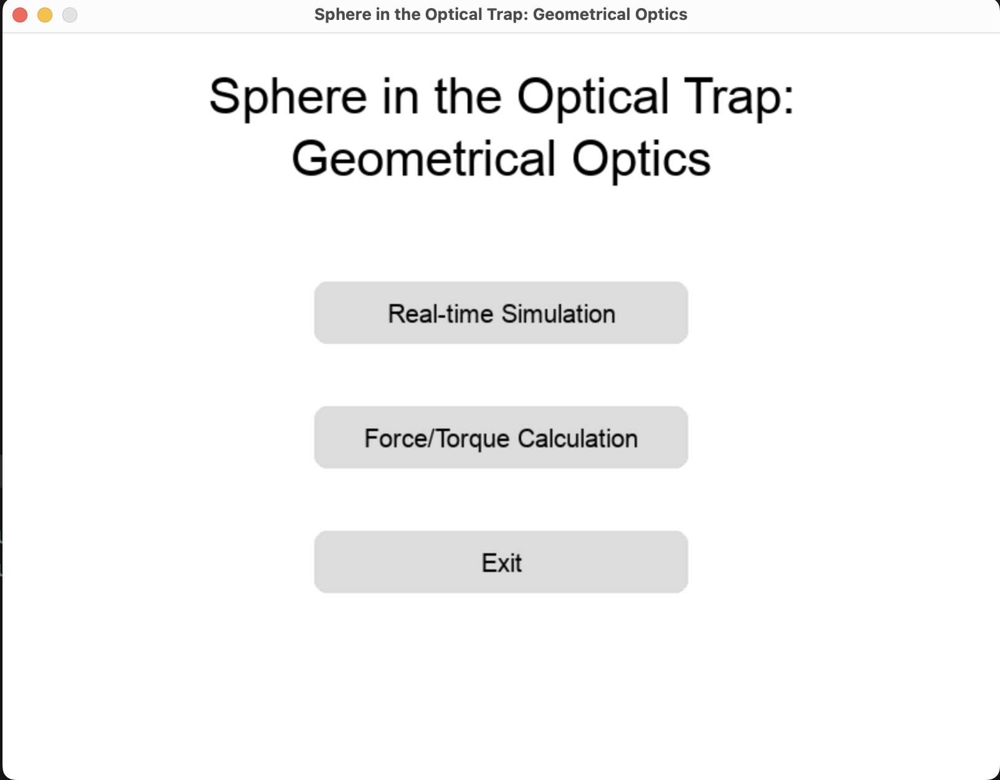

# Sphere in the Optical Trap: Geometrical Optics

## Overview
This project simulates the behavior of a spherical particle trapped in an optical trap using principles of geometrical optics. The simulation models the forces acting on the sphere due to the interaction with laser light, providing insights into the dynamics of optical trapping.

This project is created to demonstrate the optical trapping of a sphere and may not be used for the real force calculation.

## Implementation Details
The simulation is entirely written in Python, leveraging the **Pygame** library for the UI. Pygame provides an interactive and visually intuitive way to observe the behavior of the sphere in the optical trap, making it easier to analyze and interpret the results.

## Usage
You can start the application by running (see [Manual Installation](#manual-installation)):
```bash
python main.py
```
There are 2 option menu: 
- **Real-time Simulation**:
    > simulate the movement of a sphere in the optical trap.
- **Force Calculation**
    > calculate the force during selected axis.




## Limitations
This project is based on geometrical optics approach. If you are looking for the robust results of optical trapping forces, you may use [Optical Tweezers Toolbox](https://github.com/ilent2/ott).
- It is limited to spherical particles and does not handle irregular shapes.
- The model is based on geometrical optics and may not capture wave-optical effects.
- The wavelength of the beam of the simulation is fixed at 1064 nm. 
- Only single scattering of rays is assumed.

## Manual Installation
To use this project, follow these steps:
1. Clone the repository (installed git is required):
   ```bash
   git clone https://github.com/Petr-Ermolinskiy/Sphere_Geom_Optics_Trap.git
   ```
2. Navigate to the project directory:
    ```bash
    cd Sphere_Geom_Optics_Trap
    ```
3. Create a virtual environment using **python 3.12.7**:
    ```bash
    python -m venv venv
    ```
4. Activate the virtual environment:
   - On Windows:
    ```bash
    venv\Scripts\activate
    ```
   - On macOS/Linux:
    ```bash
    source venv/bin/activate
    ```
5. Install the required dependencies
    ```bash
    pip install -r requirements.txt
    ```
6. Run the simulation script:
    ```bash
    python main.py
    ```

## Make an executable app

You can create an executable app using pyinstaller:
```bash
pyinstaller --windowed --add-data=logo.png:. --name='GO_sphere_in_OT' main.py
```

## Author 
This project was developed by Petr Ermolinskiy.

## Cite
If you use this project in your research, please cite it as follows:
```
Ermolinskiy, Petr. "Sphere in the Optical Trap: Geometrical Optics." GitHub Repository, 2023. https://github.com/Petr-Ermolinskiy/Sphere_Geom_Optics_Trap
```